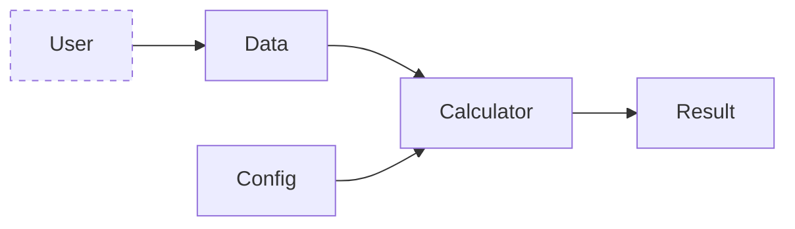
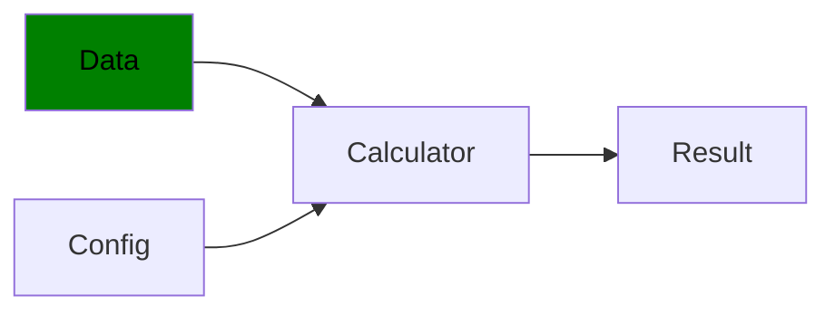
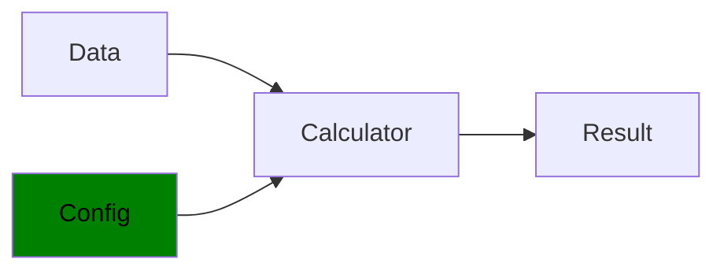
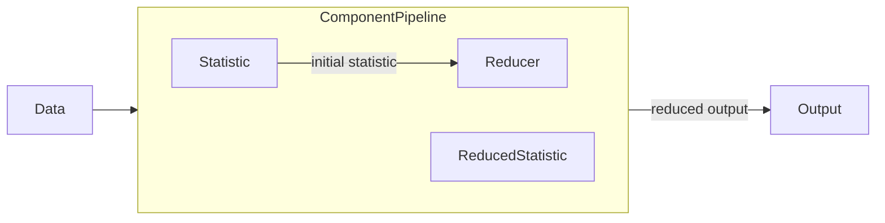
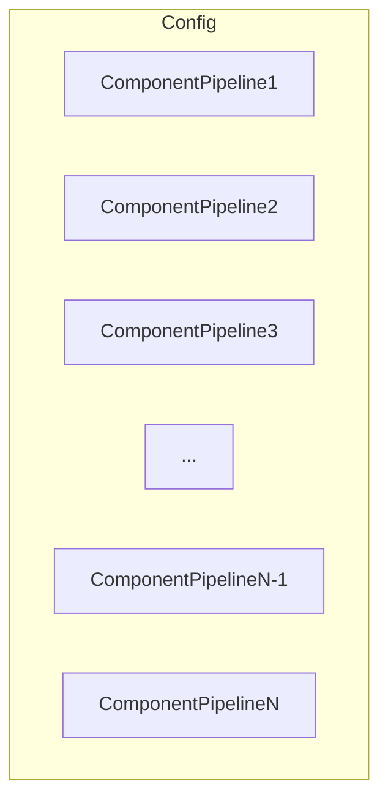
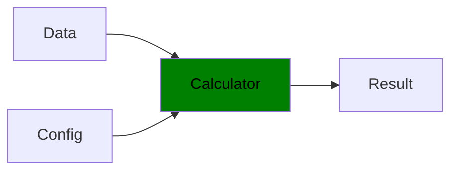
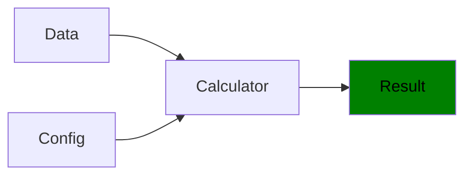
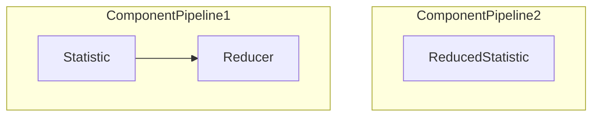

# Purpose

The main role of the library is to provide a framework for easily computing a variety of 
statistical summaries on datasets. 

A statistical summary comprises two steps, computation of a statistic and a subsequent 
summarisation step. In many cases, these two steps are independent of one another. For example, 
the covariance of a dataset yields a matrix, which we can then summarise in a variety of ways 
including extracting eigenvalues, matrix norms or the matrix determinant. Conversely, those same 
summaries can be applied to any other statistic yielding an applicable matrix. Therefore, it is 
possible to perform many combinations between the two.

In some cases, the statistic itself produces a reduced output, therefore performing the 
summary role as well. Examples include error statistics, principal component loadings or 

A number of summaries are available out of the box, along with pre-specified standard 
configurations, allowing a large number of results to be obtained from just a few lines of code. 

In-build statistical summary classes include:
- Basic
- Distance
- Casual
- Information Theory (WIP)
- Spectral (WIP)
- Wavelet (WIP)
- Miscellaneous
  
New configurations can also be created by the user for their unique case. The process of 
building custom configurations is detailed in its own section.

# Basic Usage

Generation of summary outputs involves a pipeline of three basic components and the desired output. 
Two of these components are provided by the PySS library, the other by you, the user.



- **Data**: User provided. Data must be provided as a *numpy array* or *pandas DataFrame*.
- **Config**: A PySS *Config* object. This configuration may be pre-defined, tweaked in code, 
  written from scratch or constructed in code by the user.
- **Calculator**: A PySS *Calculator* object. Responsible for executing the provided *Config* 
  against the user provided *Data*.
- **Results**: A *pandas DataFrame* of statistical results. Each row provides results for a 
  single dataset, each column a statistical summary.


## Running Standard Configurations
 
Utilizing a standard configuration can be performed in only a few lines of code. Below are the names of configurations
available immediately after installation:

- fast
- fabfour
- basic
- causal
- distance

As an example, the following code will produce results using the *fast* configuration for a dataset 
*my_dataset* provided by the user, stored in the *results* variable:

```python
from pyss import Calculator, Config

my_dataset = ...
cfg = Config.from_internal("fast")
calc = Calculator(my_dataset)
calc.compute(cfg)
results = calc.results
```

## Running Custom Configurations

For information on building custom configurations please see section .

In the event that the user has their own configuration available, similar code can be utilized. Configuration
files can either be in the YAML or JSON formats. Configuration names are optional. When not specified, 
the configuration file name will be used.

### YAML

The following code snippet uses a YAML configuration file with the following details:
- **File path:** "C:/configs/my_yaml_config.yaml"
- **Name:** "new_config"

```python
from pyss import Calculator, Config

my_dataset = ...
my_yaml_file_path = "C:/configs/my_yaml_config.yaml"
my_config_name = "new_config"
cfg = Config.from_yaml_file(my_config_name, my_yaml_file_path)
calc = Calculator(my_dataset)
calc.compute(cfg)
results = calc.results
```

### JSON

The following code snippet uses a JSON configuration file with the following details:
- **File path:** "C:/configs/my_json_config.json"
- **Name:** "new_config"

```python
from pyss import Calculator, Config

my_dataset = ...
my_json_file_path = "C:/configs/my_json_config.json"
my_config_name = "new_config"
cfg = Config.from_json_file(my_config_name, my_json_file_path)
calc = Calculator(my_dataset)
calc.compute(cfg)
results = calc.results
```

### In-Memory Dictionary

Finally, a Python dictionary can be provided instead with the following details:
- **Dictionary Object:** my_config_dict
- **Name:** "new_config"

```python
from pyss import Calculator, Config

my_dataset = ...
my_config_dict = {
	"Statistics": ...,
	"Reducers" ...
	}
my_config_name = "new_config"
cfg = Config.from_dict(my_config_name, my_config_dict)
calc = Calculator(my_dataset)
calc.compute(cfg)
results = calc.results
```

# PySS Overview

We provide an overview of the main objects that the PySS framework provides for computing
statistics. This will provide high level information required to understand how PySS functions
internally.


## Pipeline Objects

We now document the **_PySS_** objects that form the pipeline users will typically be exposed to.


## Data



A user provided dataset subject to statistical summarisation.

### Contract

- *Data* is a **one- or two-dimensional dataset** consisting of $n$ observations and $p$ 
  variables. \
AND
- *Data* is provided as a *numpy array* or *pandas DataFrame*.

### Additional Notes

If column headers exist within the provided object, these will be utilised in the pipeline.

Once provided to the framework, **_Pyss_** wraps the data in an internal *Dataset* object which 
performs various checks, cleansing operations and transformations required for further 
processing by the *Calculator* object. The functionality of the *Dataset* object is explored 
below in its own section.

## Config



The *Config* object is an abstraction of a pyss configuration. It allows the PySS framework to 
keep track of active configurations and apply efficiencies where possible. 

### Contract

A valid *Config* object consists of:
- *Config* consists of at least one valid *Statistic* and one valid *Reducer*. \
OR
- *Config* consists of a valid *ReducedStatistic*.

Please see the *Additional Notes* section for more information on these requirements.

### Components

Configurations and the *Config* object are built up using elements called *Components*. The 
*Component* is a building block for a valid PySS configuration and an abstract object within
the framework. The user will rarely interact with the *Component* object directly, however it is
integral to the formation of a *ComponentPipeline* that generates statistical outputs.

Every *Component* is stored in a Python *module*. When building configurations, a *Component* is
referred to by both its own name and the *module* that houses the object, similar to how a file
path contains both the file name and directory containing the file.

There are two types of *Component*: the *Statistic* and the *Reducer*. These objects are arranged 
sequentially, forming a *Component Pipeline* that follows the following steps:

- The *Statistic* calculates an initial statistical output from the data.
- The *Reducer* takes the *Statistic* output as input and applies dimensionality reduction.

There is also a special type of *Statistic* called the *ReducedStatistic* that performs both of 
the roles described above, essentially forming pipeline by itself.

A visualization of the pipeline is therefore as follows:




A valid *Config* must contain at least one *ComponentPipeline*. The output of this pipeline is a 
statistical summary.

As the final results returned to the user will likely involve many such statistical summaries, a 
valid *Config* can be thought of as a series of *ComponentPipelines*, each producing an output 
that occupies the final result.

The process is roughly visualised below:



The combination of these elements produces a statistical summary which occupies the final
results provided to the user.

> More discussion on *Components* are discussed in the 
> [Component Objects](#component-objects) section below.

### Additional Notes

Moreover, the *Config* object provides three main services to the user:
1. A unified structure and interface for any supported configuration format. This allows for a
   variety of configuration formats to be provided and interchanged.
2. A means of building or modifying configurations in code.
3. Export functionality that allows for creating YAML or JSON configuration files.

> More discussion on the features supported by PySS configurations, in addition to the 
functionality of the *Config* and *Component* objects, are discussed in the 
[Advanced Concepts](#advanced-user-concepts) section.

## Calculator



The *Calculator* is the main engine of Pyss. It is responsible for applying the supplied 
*Config* to the user provided *Data*, providing the required statistical summaries as output.

### Contract

- *Calculator* must receive a valid *Data* object. \
AND
- *Calculator* must receive a valid *Config* object.

### Additional Notes

Contrary to the object name, the *Calculator* is an executive function within the Pyss framework.
It manages and organises connected elements of the *Pyss Pipeline* by executing the following 
tasks:
1. Serialises the provided *Config* into a procedure. 
2. Delegates statistical calculations to the relevant *Components*. 
3. Collates, reshapes (if required) and returns outputs as the final *Result*.

Reshaping is applied to *Component* outputs and consists of basic sanity checks and automatic 
row-wise flattening of any output with dimensionality greater than one.

## Result



A row vector with each element a statistical summary of the user provided dataset.

### Contract

- *Result* is a single row *pandas DataFrame*.

### Additional Notes.

The length of the output depends on the configuration provided. Some statistical summaries
provide a vector output, therefore contributing multiple elements to the final result.

The result is provided as a *pandas DataFrame* of type *float64*, with column names based on the 
names and schemes of the *Statistic* and *Reducer* used to compute the output.

## Component Objects

Recall the *Config* diagram depicting a series of *ComponentPipelines*. The two examples of a 
valid pipeline can be illustrated as follows:



Each type of *Component* must follow a *Contract*, which dictates the requirements on data 
received and produced. Contracts are described in the relevant sections below.

## Statistic

The *Statistic* object is responsible for producing a valid statistic for both univariate and
multivariate datasets. There are a number of specific *Statistic* objects that operate on data
in slightly different ways.

### Statistic

The basic *Statistic* class that computes a statistic on the *Data* in a single function.

#### Contract

- Input: $n \times p$ *numpy array*.
- Output:
    - $p \times p$ *numpy array*. \
      OR
    - $n \times n$ *numpy array*.

Hence, input consists of a pair of real vectors of equivalent length. Output is required to be a single real scalar. The
collection of results into a matrix is performed automatically by the framework.

### PairwiseStatistic

A derived *Statistic* class used specifically for statistics that perform pairwise operations
over an axis or dimension of the *Data*. For each pair, computes a statistic and returns the
result for that pair. The final result is a matrix containing all pairwise results.

For example, for an $n \times p$ *Data* object, if iteration is performed over the $n$
observations then there are $n^2$ pairs. Therefore, the *PairwiseStatistic* will produce $n^2$
results, collected into an $n \times n$ matrix.

#### Contract

- Input:
    - Two $n \times 1$ *numpy arrays* (observations). \
      OR
    - Two $p \times 1$ *numpy arrays* (variables).
- Output:
    - $1 \times 1$ *numpy array*. \
      OR
    - *float* scalar.

Hence, input consists of a pair of real vectors of equivalent length. Output is required to be a
single real scalar. The collection of results into a matrix is performed automatically by the
framework.

### ReducedStatistic

A derived *Statistic* class that acts as both a *Statistic* and *Reducer* in one. Therefore, the
*Contract* of the *ReducedStatistic* has the input from the *Statistic* class and the output
from the *Reducer* class.

#### Contract

- Input:
    - $n \times p$ *numpy array*.
- Output:
    - $m \times 1$ *numpy array* such that $m < \min(n^2,p^2)$ \
      OR
    - *float* scalar.

It should also be noted that new *ReducedStatistics* can inherit from the *PairwiseStatistic*
class, in which case the input leg of the *Contract* will be the same.

## Reducer

The *Reducer* object is responsible for applying dimensionality reduction methods to 
multivariate statistical outputs from the *Statistic* class. Since *Statistics* form a 
square matrix, many of these methods will be based on linear algebra concepts.

#### Contract

- Input:
    - $p \times p$ *numpy array* \
      OR
    - $n \times n$ *numpy array*
- Output:
    - $m \times 1$ *numpy array* such that $m < \min(n^2,p^2)$ \
      OR
    - *float* scalar.

As such *ReducedStatistics*, the output must be smaller than the original input both in terms of 
dimension and data quantity. If a *Reducer* returns a matrix or tensor of high order, the result 
is flattened by **_PySS_** before being returned to the user.

# Advanced User Concepts

## Configurations

Any configuration that contains a *Statistic* declaration **must** be accompanied by at least
one *Reducer* object (and vice versa).

The special *Statistic* object called the *ReducedStatistic* is the one exception to
this rule, as it acts as both *Statistic* and *Reducer* objects in one, performing the necessary
two-step process in a single operation. As such, a valid configuration can be formed with only
*ReducedStatistic* objects if desired.

### Configuration Elements

In addition to the aforementioned requirements, the hierarchy and basic format of a valid 
configuration is as follows:

```
ComponentType:
+-- Module:
    +-- Component:
        +-- schemes:
            +-- schemeName:
                +-- schemeParameters
```

We will describe the role of each of these items and then provide an example of a fully realised
configuration.

#### Component Type

This is simply a declaration of whether the following *Components* are *Statistics*, *Reducers*
or *ReducedStatistics*. Therefore, it provides a logical container for *Components* of the same
type.

#### 3. Install with _pip_
Using `pip` for [`pyspi`](https://pypi.org/project/pyspi/):
```
pip install pyspi
```

For a more detailed guide on how to install _pyspi_, as well as how you can use _pyspi_ without first installing Octave, 
please see the [full documentation](https://time-series-features.gitbook.io/pyspi/installation/installing-pyspi).
Additionally, we provide a comprehensive [troubleshooting guide](https://time-series-features.gitbook.io/pyspi/installation/troubleshooting) for users who encounter issues installing _pyspi_ on their system,
as well as [alternative installation options](https://time-series-features.gitbook.io/pyspi/installation/alternative-installation-options). 

## Getting Started 🚀

Once you have installed _pyspi_, you can learn how to apply the package by checking out the [walkthrough tutorials](https://time-series-features.gitbook.io/pyspi/usage/walkthrough-tutorials) in our documentation.  Click any of the examples below to access the tutorials in our full documentation:

- [Simple demonstration](https://time-series-features.gitbook.io/pyspi/usage/walkthrough-tutorials/getting-started-a-simple-demonstration)

- [Finance: stock price time series](https://time-series-features.gitbook.io/pyspi/usage/walkthrough-tutorials/finance-stock-price-time-series)


- [Neuroimaging: fMRI time series)](https://time-series-features.gitbook.io/pyspi/usage/walkthrough-tutorials/neuroimaging-fmri-time-series)

### Advanced Usage
For advanced users, we offer several additional guides in the [full documentation](https://time-series-features.gitbook.io/pyspi/usage/advanced-usage) on how you can distribute your _pyspi_ jobs across PBS clusters, as well as how you can construct your own subsets of SPIs. 

## SPI Descriptions 📋
To access a table with a high-level overview of the _pyspi_ library of SPIs, including their associated identifiers, see the [table of SPIs](https://time-series-features.gitbook.io/pyspi/spis/table-of-spis) in the full documentation.
For detailed descriptions of each SPI, as well as its associated estimators, we provide a full breakdown in the [SPI descriptions](https://time-series-features.gitbook.io/pyspi/spis/spi-descriptions) page of our documentation. 

## Documentation
The full documentation is hosted on [GitBooks](https://time-series-features.gitbook.io/pyspi/). 
Use the following links to quickly access some of the key sections:

- [Full installation guide](https://time-series-features.gitbook.io/pyspi/installation)
- [Troubleshooting](https://time-series-features.gitbook.io/pyspi/installation/troubleshooting)
- [Alternative installation options](https://time-series-features.gitbook.io/pyspi/installation/alternative-installation-options)
- [Usage guide](https://time-series-features.gitbook.io/pyspi/usage)
- [Distributing _pyspi_ computations](https://time-series-features.gitbook.io/pyspi/usage/advanced-usage/distributing-calculations-on-a-cluster)
- [Table of SPIs and descriptions](https://time-series-features.gitbook.io/pyspi/spis)
- [FAQ](https://time-series-features.gitbook.io/pyspi/usage/faq)
- [API Reference](https://time-series-features.gitbook.io/pyspi/api-reference)
- [Development guide](https://time-series-features.gitbook.io/pyspi/development)

## Contributing to _pyspi_ 👨‍👨‍👦‍👦
Contributions play a vital role in the continual development and enhancement of _pyspi_, a project built and enriched through community collaboration.
If you would like to contribute to _pyspi_, or explore the many ways in which you can participate in the project, please have a look at our 
detailed [contribution guidelines](https://time-series-features.gitbook.io/pyspi/development/contributing-to-pyspi) about how to proceed.
In contributing to _pyspi_, all participants are expected to adhere to our [code of conduct](https://time-series-features.gitbook.io/pyspi/development/code-of-conduct).

### SPI Wishlist
We strive to provide the most comprehensive toolkit of SPIs. If you have ideas for new SPIs or suggestions for improvements to existing ones, we are eager to hear from and collaborate with you! 
Any pairwise dependence measure, provided it is accompanied by a published research paper, typically falls within the scope for consideration in the 
_pyspi_ library.
You can access our SPI wishlist via the [projects tab](https://github.com/DynamicsAndNeuralSystems/pyspi/projects) in this repo to open a request.

## Acknowledgement 👍

If you use this software, please read and cite this article:

- &#x1F4D7; O.M. Cliff, A.G. Bryant, J.T. Lizier, N. Tsuchiya, B.D. Fulcher. [Unifying pairwise interactions in complex dynamics](https://doi.org/10.1038/s43588-023-00519-x), _Nature Computational Science_ (2023).

Note that [preprint](https://arxiv.org/abs/2201.11941) and [free-to-read](https://rdcu.be/dn3JB) versions of this article are available.

<details closed>
    <summary>Click here for a BibTex reference:</summary>

```
@article{Cliff2023:UnifyingPairwiseInteractions,
	title = {Unifying pairwise interactions in complex dynamics},
	volume = {3},
	issn = {2662-8457},
	url = {https://www.nature.com/articles/s43588-023-00519-x},
	doi = {10.1038/s43588-023-00519-x},
	number = {10},
	journal = {Nature Computational Science},
	author = {Cliff, Oliver M. and Bryant, Annie G. and Lizier, Joseph T. and Tsuchiya, Naotsugu and Fulcher, Ben D.},
	month = oct,
	year = {2023},
	pages = {883--893},
}
```

</details>

## Other highly comparative toolboxes 🧰
If you are interested in trying other highly comparative toolboxes like _pyspi_, see the below list:

- [_hctsa_](https://github.com/benfulcher/hctsa), the _highly comparative time-series analysis_ toolkit, computes over 7000 time-series features from univariate time series.
- [_hcga_](https://github.com/barahona-research-group/hcga), a _highly comparative graph analysis_ toolkit, computes several thousands of graph features directly from any given network.


## Our Contributors 🌟
We are thankful for the contributions of each and everyone who has helped make this project better. 
Whether you've added a line of code, improved our documentation, or reported an issue, your contributions are greatly appreciated! 
Below are some of the leading contributors to _pyspi_:

<a href="https://github.com/DynamicsAndNeuralSystems/pyspi/graphs/contributors">
  
</a>

## License 🧾
_pyspi_ is released under the [GNU General Public License](https://www.gnu.org/licenses/gpl-3.0).
