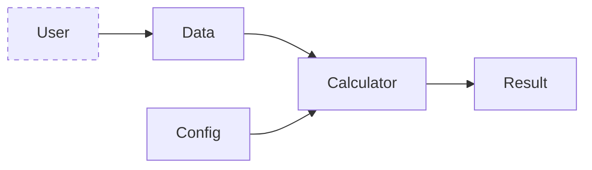
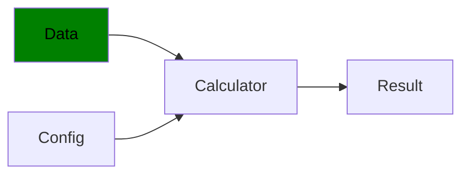
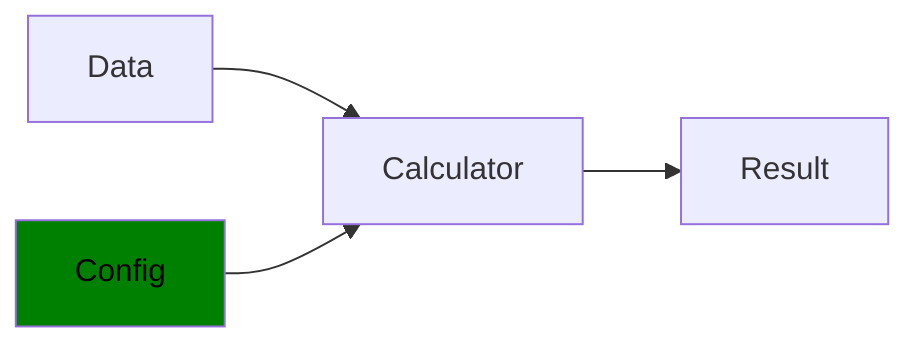
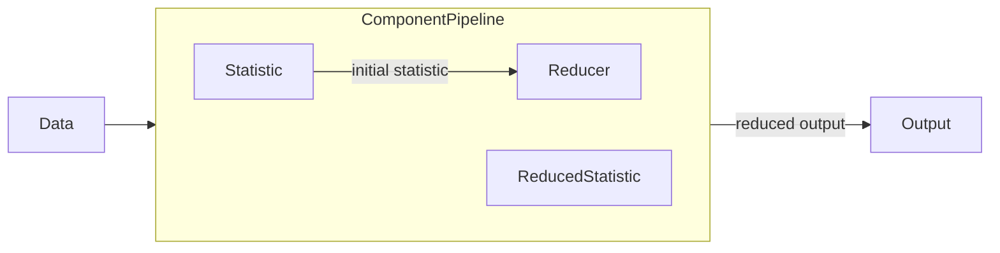
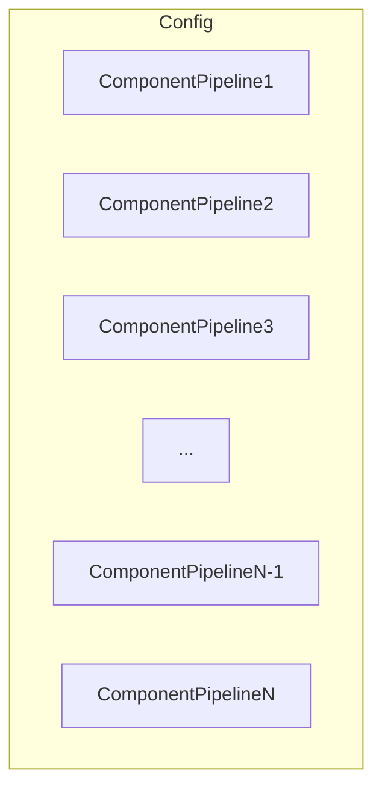
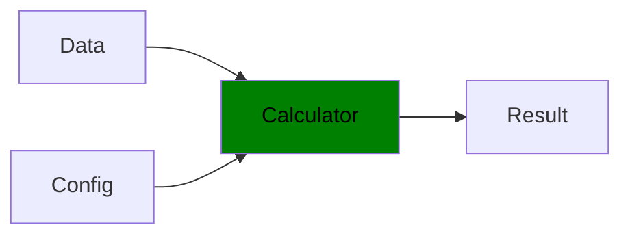
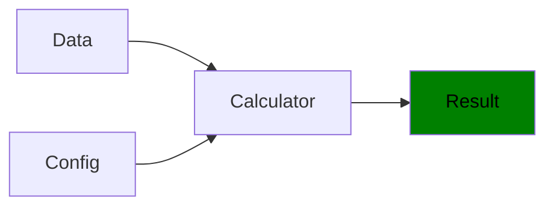
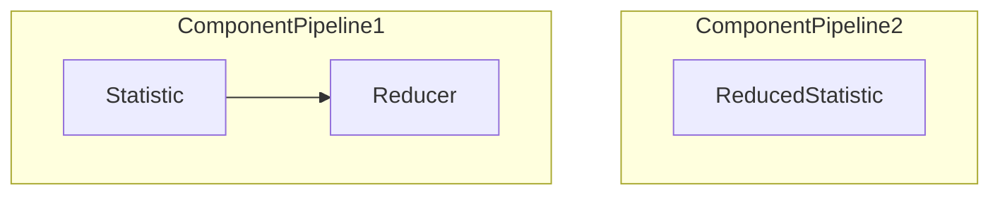

# Table of Contents

[[TOC]]

# Purpose

The main role of the library is to provide a framework for easily computing a variety of 
statistical summaries on datasets. 

A statistical summary comprises two steps, computation of a statistic and a subsequent 
summarisation step. In many cases, these two steps are independent of one another. For example, 
the covariance of a dataset yields a matrix, which we can then summarise in a variety of ways 
including extracting eigenvalues, matrix norms or the matrix determinant. Conversely, those same 
summaries can be applied to any other statistic yielding an applicable matrix. Therefore, it is 
possible to perform many combinations between the two.

In some cases, the statistic itself produces a reduced output, therefore performing the 
summary role as well. Examples include error statistics, principal component loadings or 

A number of summaries are available out of the box, along with pre-specified standard 
configurations, allowing a large number of results to be obtained from just a few lines of code. 

In-build statistical summary classes include:
- Basic
- Distance
- Casual
- Information Theory (WIP)
- Spectral (WIP)
- Wavelet (WIP)
- Miscellaneous
  
New configurations can also be created by the user for their unique case. The process of 
building custom configurations is detailed in its own section.

# Basic Usage

Generation of summary outputs involves a pipeline of three basic components and the desired output. 
Two of these components are provided by the PySS library, the other by you, the user.



- **Data**: User provided. Data must be provided as a *numpy array* or *pandas DataFrame*.
- **Config**: A PySS *Config* object. This configuration may be pre-defined, tweaked in code, 
  written from scratch or constructed in code by the user.
- **Calculator**: A PySS *Calculator* object. Responsible for executing the provided *Config* 
  against the user provided *Data*.
- **Results**: A *pandas DataFrame* of statistical results. Each row provides results for a 
  single dataset, each column a statistical summary.


## Running Standard Configurations
 
Utilizing a standard configuration can be performed in only a few lines of code. Below are the names of configurations
available immediately after installation:

- fast
- fabfour
- basic
- causal
- distance

As an example, the following code will produce results using the *fast* configuration for a dataset 
*my_dataset* provided by the user, stored in the *results* variable:

```python
from pyss import Calculator, Config

my_dataset = ...
cfg = Config.from_internal("fast")
calc = Calculator(my_dataset)
calc.compute(cfg)
results = calc.results
```

## Running Custom Configurations

For information on building custom configurations please see section .

In the event that the user has their own configuration available, similar code can be utilized. Configuration
files can either be in the YAML or JSON formats. Configuration names are optional. When not specified, 
the configuration file name will be used.

### YAML

The following code snippet uses a YAML configuration file with the following details:
- **File path:** "C:/configs/my_yaml_config.yaml"
- **Name:** "new_config"

```python
from pyss import Calculator, Config

my_dataset = ...
my_yaml_file_path = "C:/configs/my_yaml_config.yaml"
my_config_name = "new_config"
cfg = Config.from_yaml_file(my_config_name, my_yaml_file_path)
calc = Calculator(my_dataset)
calc.compute(cfg)
results = calc.results
```

### JSON

The following code snippet uses a JSON configuration file with the following details:
- **File path:** "C:/configs/my_json_config.json"
- **Name:** "new_config"

```python
from pyss import Calculator, Config

my_dataset = ...
my_json_file_path = "C:/configs/my_json_config.json"
my_config_name = "new_config"
cfg = Config.from_json_file(my_config_name, my_json_file_path)
calc = Calculator(my_dataset)
calc.compute(cfg)
results = calc.results
```

### In-Memory Dictionary

Finally, a Python dictionary can be provided instead with the following details:
- **Dictionary Object:** my_config_dict
- **Name:** "new_config"

```python
from pyss import Calculator, Config

my_dataset = ...
my_config_dict = {
	"Statistics": ...,
	"Reducers" ...
	}
my_config_name = "new_config"
cfg = Config.from_dict(my_config_name, my_config_dict)
calc = Calculator(my_dataset)
calc.compute(cfg)
results = calc.results
```

# PySS Overview

We provide an overview of the main objects that the PySS framework provides for computing
statistics. This will provide high level information required to understand how PySS functions
internally.


## Pipeline Objects

We now document the **_PySS_** objects that form the pipeline users will typically be exposed to.


## Data



A user provided dataset subject to statistical summarisation.

### Contract

- *Data* is a **one- or two-dimensional dataset** consisting of $n$ observations and $p$ 
  variables. \
AND
- *Data* is provided as a *numpy array* or *pandas DataFrame*.

### Additional Notes

If column headers exist within the provided object, these will be utilised in the pipeline.

Once provided to the framework, **_Pyss_** wraps the data in an internal *Dataset* object which 
performs various checks, cleansing operations and transformations required for further 
processing by the *Calculator* object. The functionality of the *Dataset* object is explored 
below in its own section.

## Config



The *Config* object is an abstraction of a pyss configuration. It allows the PySS framework to 
keep track of active configurations and apply efficiencies where possible. 

### Contract

A valid *Config* object consists of:
- *Config* consists of at least one valid *Statistic* and one valid *Reducer*. \
OR
- *Config* consists of a valid *ReducedStatistic*.

Please see the *Additional Notes* section for more information on these requirements.

### Components

Configurations and the *Config* object are built up using elements called *Components*. The 
*Component* is a building block for a valid PySS configuration and an abstract object within
the framework. The user will rarely interact with the *Component* object directly, however it is
integral to the formation of a *ComponentPipeline* that generates statistical outputs.

Every *Component* is stored in a Python *module*. When building configurations, a *Component* is
referred to by both its own name and the *module* that houses the object, similar to how a file
path contains both the file name and directory containing the file.

There are two types of *Component*: the *Statistic* and the *Reducer*. These objects are arranged 
sequentially, forming a *Component Pipeline* that follows the following steps:

- The *Statistic* calculates an initial statistical output from the data.
- The *Reducer* takes the *Statistic* output as input and applies dimensionality reduction.

There is also a special type of *Statistic* called the *ReducedStatistic* that performs both of 
the roles described above, essentially forming pipeline by itself.

A visualization of the pipeline is therefore as follows:




A valid *Config* must contain at least one *ComponentPipeline*. The output of this pipeline is a 
statistical summary.

As the final results returned to the user will likely involve many such statistical summaries, a 
valid *Config* can be thought of as a series of *ComponentPipelines*, each producing an output 
that occupies the final result.

The process is roughly visualised below:



The combination of these elements produces a statistical summary which occupies the final
results provided to the user.

> More discussion on *Components* are discussed in the 
> [Component Objects](#component-objects) section below.

### Additional Notes

Moreover, the *Config* object provides three main services to the user:
1. A unified structure and interface for any supported configuration format. This allows for a
   variety of configuration formats to be provided and interchanged.
2. A means of building or modifying configurations in code.
3. Export functionality that allows for creating YAML or JSON configuration files.

> More discussion on the features supported by PySS configurations, in addition to the 
functionality of the *Config* and *Component* objects, are discussed in the 
[Advanced Concepts](#advanced-user-concepts) section.

## Calculator



The *Calculator* is the main engine of Pyss. It is responsible for applying the supplied 
*Config* to the user provided *Data*, providing the required statistical summaries as output.

### Contract

- *Calculator* must receive a valid *Data* object. \
AND
- *Calculator* must receive a valid *Config* object.

### Additional Notes

Contrary to the object name, the *Calculator* is an executive function within the Pyss framework.
It manages and organises connected elements of the *Pyss Pipeline* by executing the following 
tasks:
1. Serialises the provided *Config* into a procedure. 
2. Delegates statistical calculations to the relevant *Components*. 
3. Collates, reshapes (if required) and returns outputs as the final *Result*.

Reshaping is applied to *Component* outputs and consists of basic sanity checks and automatic 
row-wise flattening of any output with dimensionality greater than one.

## Result



A row vector with each element a statistical summary of the user provided dataset.

### Contract

- *Result* is a single row *pandas DataFrame*.

### Additional Notes.

The length of the output depends on the configuration provided. Some statistical summaries
provide a vector output, therefore contributing multiple elements to the final result.

The result is provided as a *pandas DataFrame* of type *float64*, with column names based on the 
names and schemes of the *Statistic* and *Reducer* used to compute the output.

## Component Objects

Recall the *Config* diagram depicting a series of *ComponentPipelines*. The two examples of a 
valid pipeline can be illustrated as follows:



Each type of *Component* must follow a *Contract*, which dictates the requirements on data 
received and produced. Contracts are described in the relevant sections below.

## Statistic

The *Statistic* object is responsible for producing a valid statistic for both univariate and
multivariate datasets. There are a number of specific *Statistic* objects that operate on data
in slightly different ways.

### Statistic

The basic *Statistic* class that computes a statistic on the *Data* in a single function.

#### Contract

- Input: $n \times p$ *numpy array*.
- Output:
    - $p \times p$ *numpy array*. \
      OR
    - $n \times n$ *numpy array*.

Hence, input consists of a pair of real vectors of equivalent length. Output is required to be a single real scalar. The
collection of results into a matrix is performed automatically by the framework.

### PairwiseStatistic

A derived *Statistic* class used specifically for statistics that perform pairwise operations
over an axis or dimension of the *Data*. For each pair, computes a statistic and returns the
result for that pair. The final result is a matrix containing all pairwise results.

For example, for an $n \times p$ *Data* object, if iteration is performed over the $n$
observations then there are $n^2$ pairs. Therefore, the *PairwiseStatistic* will produce $n^2$
results, collected into an $n \times n$ matrix.

#### Contract

- Input:
    - Two $n \times 1$ *numpy arrays* (observations). \
      OR
    - Two $p \times 1$ *numpy arrays* (variables).
- Output:
    - $1 \times 1$ *numpy array*. \
      OR
    - *float* scalar.

Hence, input consists of a pair of real vectors of equivalent length. Output is required to be a
single real scalar. The collection of results into a matrix is performed automatically by the
framework.

### ReducedStatistic

A derived *Statistic* class that acts as both a *Statistic* and *Reducer* in one. Therefore, the
*Contract* of the *ReducedStatistic* has the input from the *Statistic* class and the output
from the *Reducer* class.

#### Contract

- Input:
    - $n \times p$ *numpy array*.
- Output:
    - $m \times 1$ *numpy array* such that $m < \min(n^2,p^2)$ \
      OR
    - *float* scalar.

It should also be noted that new *ReducedStatistics* can inherit from the *PairwiseStatistic*
class, in which case the input leg of the *Contract* will be the same.

## Reducer

The *Reducer* object is responsible for applying dimensionality reduction methods to 
multivariate statistical outputs from the *Statistic* class. Since *Statistics* form a 
square matrix, many of these methods will be based on linear algebra concepts.

#### Contract

- Input:
    - $p \times p$ *numpy array* \
      OR
    - $n \times n$ *numpy array*
- Output:
    - $m \times 1$ *numpy array* such that $m < \min(n^2,p^2)$ \
      OR
    - *float* scalar.

As such *ReducedStatistics*, the output must be smaller than the original input both in terms of 
dimension and data quantity. If a *Reducer* returns a matrix or tensor of high order, the result 
is flattened by **_PySS_** before being returned to the user.

# Advanced User Concepts

## Configurations

Any configuration that contains a *Statistic* declaration **must** be accompanied by at least
one *Reducer* object (and vice versa).

The special *Statistic* object called the *ReducedStatistic* is the one exception to
this rule, as it acts as both *Statistic* and *Reducer* objects in one, performing the necessary
two-step process in a single operation. As such, a valid configuration can be formed with only
*ReducedStatistic* objects if desired.

### Configuration Elements

In addition to the aforementioned requirements, the hierarchy and basic format of a valid 
configuration is as follows:

```
ComponentType:
+-- Module:
    +-- Component:
        +-- schemes:
            +-- schemeName:
                +-- schemeParameters
```

We will describe the role of each of these items and then provide an example of a fully realised
configuration.

#### Component Type

This is simply a declaration of whether the following *Components* are *Statistics*, *Reducers*
or *ReducedStatistics*. Therefore, it provides a logical container for *Components* of the same
type.

#### Module

A reference to the Python module containing the *Component*.

- Internal modules are referenced by the standard Python "dot" convention (ie.
  pyss.statistics.basic).
- External modules are referenced by the full path to the module file (ie. C:\\My Modules\\My
  Components.py).

#### Component

Indicates the name of the *Component*.

> A list of available Statistics, Reducers and ReducedStatistics can be found in the [PySS
Components](#pyss-components) section.

#### Schemes

A scheme simply refers to one specific parameterisation of a *Component*.

For example, the Statistic *Covariance* takes the parameter *estimator*, which dictates the type
of covariance statistic calculated. Therefore, it's possible to have multiple Covariance objects
in a single configuration but with different parameterisations returning different results. This
distinction is wrapped up in a *Scheme*

#### Reducer Filters

By default, *Reducers* are applied to every *Statistic* scheme specified in the configuration. 
However, any *Reducer* can be filtered to only produce outputs for certain *Statistic* schemes. The 
designation follows the "dot" format, with each step in the configuration hierarchy providing an 
attribute in the format: `Module.Component.schemeName`

For example, our configuration contains the following *Statistic* setup:

```yaml
Statistics:
  my_statistic_module:
    MyStatistic:
      schemes:
        scheme_1:
          .
          .
          .
        scheme_2:
          .
          .
          .
        .
        .
        .

```

We wish to add a *Reducer* `MyReducer` to the configuration and **limit** its operation to our 
*Statistic* `MyStatistic` above. This can be achieved with the following structure:

```yaml
Reducers:
  my_reducer_module:
    MyReducer:
      filters:
        - "my_statistic_module.MyStatistic.scheme_1"
      schemes:
        .
        .
        .
```

Additional **operators** are available to provide flexibility in setting filters:
- `*` acts as a wild card. It can be used at any step in the attribute path. Examples include:
  - The designation `"my_statistic_module.MyStatistic.*"` will limit the *Reducer* to only
    `MyStatistic` parameterisation schemes.
  - The designation `"my_statistic_module.*` will limit the *Reducer* to only *Statistics* in your 
    configuration under the module `my_statistic_module`.
  - The designation `"my_statistic_module.*.scheme_1"` will limit the *Reducer* to schemes with the 
    name `scheme_1` belonging to *Statistics* under the module `my_statistic_module`. 
- `¬` prepended to the attribute path acts as a negation. Examples include:
  - The designation `"¬my_statistic_module.MyStatistic.scheme_1"` will prevent the *Reducer* 
    operating on scheme `scheme_1` under `MyStatistic`.

> Affirmative and negative filters combine differently. For example:
> - Multiple affirmative (normal) filters: Inclusive (OR condition). A scheme that matches any
    filter will be included.
> - Multiple negative filters: Exclusive (AND condition/NOT OR condition). A scheme that matches
    no filter will be included.
> - Affirmatives and negatives: Exclusive (AND condition). A scheme that matches any affirmative
    and no negative will be included.

The two operators can be also combined:
- The designation `"¬my_statistic_module.MyStatistic.*"` will prevent the *Reducer* operating on 
  any scheme under the *Statistic* `MyStatistic`.
- The designation `"¬my_statistic_module.*.scheme_1"` will prevent the *Reducer* operating on 
  any scheme named `scheme_1` under the module `my_statistic_module`.

### Additional Notes

By default, every configured *Statistic* is subject to reduction by every configured *Reducer*.
Therefore, by default, the output of a configuration is the Cartesian product of the set of
*Statistics* with the set of *Reducers*. It is important to remember this when adding a new
*Statistic* or *Reducer* to a configuration without filtering.

### Templates

Below we provide generic templates for a valid configuration in different formats.

In the following configuration templates, we assume the following:

- *Statistic_1* and *Statistic_2* are both contained within the same Python *module* called
  *StatisticModule_1*.
- *Reducer_1* and *Reducer_2* are both contained within the same Python *module* called
  *ReducerModule_2*
- All other *Components* are stored in their own Python *modules*.

#### YAML

The required YAML format for a configuration file is as follows:

```yaml
Statistics:
    statistic_module_1:
        Statistic_1:
            schemes:
                scheme_1:
                    parameter_1: parameter_1_value
                    parameter_2: parameter_2_value
				scheme_2:
					parameter_1: parameter_1_value
					parameter_2: parameter_2_value
                    .
                    .
                    .
                    parameter_n: parameter_n_value
                .
                .
                .
                scheme_n:
                    parameter_1: parameter_1_value
                    parameter_2: parameter_2_value
                    .
                    .
                    .
        Statistic_2:
            schemes:
              .
              .
              .
        .
        .
        .
    statistic_module_2:
        Statistic_m:
            schemes:
                scheme_1:
                    parameter_1: parameter_1_value
                    parameter_2: parameter_2_value
                    .
                    .
                    .
    .
    .
    .
	
Reducers:
    reducer_module_1:
        Reducer_1:
            filters:
                - "statistic_module_1.Statistic_1.scheme_2"
                - "statistic_module_2.Statistic_3.scheme_1"
                - "¬statistic_module_3.*"
                .
                .
                .
            
            schemes:
                scheme_1:                    
                    .
                    .
                    .
    .
    .
    .
    reducer_module_p:
        .
        .
        .
```

#### JSON

The required JSON format for a configuration file is as follows:

```json
{
    "Statistics": {
        "statistic_module_1": {
            "Statistic_1": {
                "schemes": {
                    "scheme_1": {
                        "parameter_1": "parameter_1_value",
                        "parameter_2": "parameter_2_value"
                    },
                    "scheme_2": {
                        "parameter_1": "parameter_1_value",
                        "parameter_2": "parameter_2_value",
                        .,
                        .,
                        .,
                        "parameter_n": "parameter_n_value"
                    },
                    .,
                    .,
                    .
                    "scheme_n": {
                        "parameter_1": "parameter_1_value",
                        "parameter_2": "parameter_2_value",
                        .,
                        .,
                        .
                    }
                }
            },
            "Statistic_2": {
                .,
                .,
                .
            },
            .,
            .,
            .
        },
        "statistic_module_2": {
            "Statistic_m": {
                "schemes": {
                    "scheme_1": {
                        "parameter_1": "parameter_1_value",
                        "parameter_2": "parameter_2_value",
                        .,
                        .,
                        .
                    },
                    .,
                    .,
                    .
                }
                .,
                .,
                .
            }
        }
        .,
        .,
        .
    },
    "Reducers": {
        "reducer_module_1": {
            "Reducer_1": {
                "filters": [
                    "statistic_module_1.Statistic_1.scheme_2",
                    "statistic_module_2.Statistic_3.scheme_3",
                    "¬statistic_module_3.*",
                    .,
                    .
                ],
                "schemes": {
                    "scheme_1": {
                        .,
                        .,
                        .
                    },
                .,
                .,
                .
                }
            }
        },
        .,
        .,
        .
        "reducer_module_p": {
            .,
            .,
            .
        }
    }
}
```

#### Python Dictionary

Please see the JSON section above as Python dictionary objects follow the same structure. 

#### Config Object

The template configuration can be constructed through the *Config* object in two ways. We can 
specify the configuration using reference names or by passing the desired objects directly.

First, we demonstrate construction by reference:

```python

from pyss import Config

my_cfg = Config("my_cfg")
my_cfg.add_statistic_by_name(module_reference = "statistic_module_1",
                             statistic_name = "Statistic_1",
                             statistic_params = {
                                 "parameter_1": "parameter_1_value",
                                 "parameter_2": "parameter_2_value"
                             },
                             scheme_name = "scheme_1")

my_cfg.add_statistic_by_name(module_reference = "statistic_module_1",
                             statistic_name = "Statistic_1",
                             statistic_params = {
                                 "parameter_1": "parameter_1_value",
                                 "parameter_2": "parameter_2_value",
                                 .,
                                 .,
                                 .,
                                 "parameter_n": "parameter_n_value"
                             },
                             scheme_name = "scheme_2")
my_cfg.add_statistic_by_name(module_reference = "statistic_module_1",
                             statistic_name = "Statistic_1",
                             statistic_params = {
                                 "parameter_1": "parameter_1_value",
                                 "parameter_2": "parameter_2_value",
                                 .,
                                 .,
                                 .
                             },
                             scheme_name = "scheme_n")
my_cfg.add_statistic_by_name(module_reference = "statistic_module_1",
                             statistic_name = "Statistic_2",
                             .,
                             .,
                             .)

my_cfg.add_statistic_by_name(module_reference = "statistic_module_2",
                             statistic_name = "Statistic_m",
                             statistic_params = {
                                 "parameter_1": "parameter_1_value",
                                 "parameter_2": "parameter_2_value",
                                 .,
                                 .,
                                 .
                             },
                             scheme_name = "scheme_1")
.
.
.                            

my_cfg.add_reducer_by_name(module_reference = "reducer_module_1",
                           reducer_name = "Reducer_1",
                           reducer_params = {
                               .,
                               .,
                               .
                           },
                           scheme_name = "scheme_1",
                           statistic_filters = [
                               "statistic_module_1.Statistic_1.scheme_2",
                               "statistic_module_2.Statistic_3.scheme_1",
                               "¬statistic_module_3.*"
                           ])
my_cfg.add_reducer_by_name(module_reference = "reducer_module_p",
                           ...)

```
Next, we instead provide the objects directly:

```python

from pyss import Config
from statistic_module_1 import Statistic_1, Statistic_2, ...
from statistic_module_2 import Statistic_m, ...
.
.
.
from reducer_module_1 import Reducer_1, ...
from reducer_module_p import ...

# Add Statistic objects.

my_cfg = Config("my_cfg")
statistic_1_1 = Statistic_1(
    parameter_1 = "parameter_1_value",
    parameter_2 = "parameter_2_value")
my_cfg.add_statistic(statistic = statistic_1_1, 
                     scheme_name = "scheme_1")

statistic_1_2 = Statistic_1(
    parameter_1 = "parameter_1_value",
    parameter_2 = "parameter_2_value",
    .,
    .,
    .,
    parameter_n = "parameter_n_value")
my_cfg.add_statistic(statistic = statistic_1_2, 
                     scheme_name = "scheme_2")

statistic_1_n = Statistic_1(
    parameter_1 = "parameter_1_value",
    parameter_2 = "parameter_2_value",
    .,
    .,
    .
)
my_cfg.add_statistic(statistic = statistic_1_n, 
                     scheme_name = "scheme_n")

statistic_2_1 = Statistic_2(...)
my_cfg.add_statistic(statistic = statistic_2_1, 
                     scheme_name = "scheme_1")

statistic_m_1 = Statistic_m(
    parameter_1 = "parameter_1_value",
    parameter_2 = "parameter_2_value",
    .,
    .,
    .
)
my_cfg.add_statistic(statistic = statistic_m_1, 
                     scheme_name = "scheme_1")

# Add Reducer objects.

reducer_1_1 = Reducer_1(...)
my_cfg.add_reducer(reducer = reducer_1_1, 
                   scheme_name = "scheme_1", 
                   statistic_filters = [
                       "statistic_module_1.Statistic_1.scheme_2",
                       "statistic_module_2.Statistic_3.scheme_1",
                       "¬statistic_module_3.*"])
.
.
.

```

### Helper Methods

All *Components* classes possess a number of methods intended to assist users creating new 
parameterisation schemes in their configurations. Examples include:

- `get_parameters()`: Provides the parameters required a given *Component*. These can be looked 
  up using the class name, *Component* name or *Component* identifier.
- `get_output_shape()`: Provides the shape of the *numpy array* output by a given *Component* 
  class. 
- `generate_example()`: Returns an example of the result a *Component* object will produce. It can 
  produce an example on user provided data or generate a random input dataset, providing both the 
  input and output for inspection and comparison. 

> For information on these methods, please see [PySS Components](#pyss-components).

### Example

To demonstrate the format required to construct a configuration, we will consider the 
following example:

We'll derive the following general statistics:

- Statistic 1: EmpiricalCovariance [Output: $p \times p$ matrix]
- Statistic 2: EllipticEnvelope [Output: $p \times p$ matrix]
  - Variant: Squared
- Statistic 3: PairwiseDistance [Output: $n \times n$ matrix]
  - Variant: Euclidean
- Statistic 4: InformationGeometricConditionalIndependence (ICGI) [Output: $n \times n$ matrix]
  - Variant: Observations ($n$)
- Statistic 5: InformationGeometricConditionalIndependence (ICGI) [Output: $p \times p$ matrix]
  - Variant: Variables ($p$)

And we'll apply the following reductions to these statistics:

- Reducer 1: MatrixDeterminant [Output: $5$-vector]
  - Variants: Scaled
  - Statistics: All Except 5
- Reducer 2: Moments [Output: $6$-vector ($3$ moments for $2$ statistics)]
  - Selection: 1, 2, 4
  - Statistics: 3, 5
- Reducer 3: SchattenNorm [Output: $6$-vector ($3$ moments for $2$ statistics)]	
  - Selected: 2
  - Statistics: 1, 2

And finally, we'll include the following fully reduced statistics:
- ReducedStatistic 1: PCAVarianceExplained [Output: $2$-vector]
  - Selection: First 2
- ReducedStatistic 2: PCAEigenVectors [Output: $3p$-vector ($3$ loadings for $p$ variables)]
  - Selection: First 3
- ReducedStatistic 3: GaussianFit [Output: scalar]

Total number of statistical summaries: $3p + 20$.

Below we show how to construct this configuration in different formats.

> - We use the NOT operator `¬` to create a negation on the *Statistics* filter for the *Reducer*
    *Determinant*.
> - We use the WILDCARD operator `*` to include all *Statistics* under the relevant umbrella.


#### YAML

```yaml
Statistics:
	pyss.statistics.basic:
		Covariance:
			schemes:
				empirical:
					estimator: EmpiricalCovariance
				elliptic-std:
					squared: False
				elliptic-sq:
					squared: True
					
	pyss.statistics.distance:
		PairwiseDistance:
			schemes:
				euclidean:
					metric: euclidean
	
	pyss.statistics.causal:
		InformationGeometricConditionalIndependence:
			schemes:
				observation-wise:
					dim: n
				variate-wise:
					dim: p
                    
    pyss.rstatistics.basic:
        PCAVarianceExplained:
            schemes:
                first-two:
                    components:
                        - 1
                        - 2
        PCAEigenVectors:
            schemes:
                first-three:
                    vectors:
                        - 1
                        - 2
                        - 3
    pyss.rstatistics.model_fits:
        GaussianFit:
          schemes:
              main:

Reducers:
	pyss.reducers.basic:
		Determinant:
			Statistics:
				- ¬pyss.statistics.causal.InformationGeometricConditionalIndependence
			schemes:
				scaled_det:
					scaled: True	
		
		Moment:
			Statistics:
				- pyss.statistics.basic.Covariance.elliptic-sq
				- pyss.statistics.causal.InformationGeometricConditionalIndependence.variate-wise
			schemes:
				two-four:
					moments:						
						- 2
						- 4					
				
	pyss.reducers.norms:
		SchattenNorm:
			Statistics:
				- pyss.statistics.basic.*
			schemes:
				2-norm:
					p: 2			
				
```

#### JSON/Python Dictionary

```json
{
	"Statistics": {
		"pyss.statistics.basic": {
			"Covariance": {
				"schemes": {
					"empirical": "estimator"
				}
			},
			"EllipticEnvelope": {
				"schemes": {
					"standard": {
						"squared": false
					},
					"sq": {
						"squared": true
					}
				}
			}
		},
		"pyss.statistics.distance": {
			"PairwiseDistance": {
				"schemes": {
					"euclidean": {
						"metric": "euclidean"
					}
				}
			}
		},
		"pyss.statistics.causal": {
			"InformationGeometricConditionalIndepedence": {
				"schemes": {
					"observation-wise": {
						"dim": "n"
					},
					"variate-wise": {
						"dim": "p"
					}
				}
			}
		},
        "pyss.rstatistics.basic": {
            "PCAVarianceExplained": {
                "schemes": {
                    "first_two": {
                        "components": [1,2]
                    }
                }
            },
            "PCAEigenVectors": {
                "schemes": {
                    "first_three": {
                        "n_vectors": [1,2,3]
                    }
                }
            }
        },
        "pyss.rstatistics.model_fits": {
            "GaussianFit": {
                "schemes": {
                    "base": null
                }
            }
        }
	},
	"Reducers": {
		"pyss.reducers.basic": {
			"Determinant": {
				"Statistics": [
					"¬pyss.statistics.causal.InformationGeometricConditionalIndependence"
				],
				"schemes": {
					"scaled_det": {
						"scaled": true
					}
				}
			},
			"Moment": {
				"Statistics": [
					"pyss.statistics.basic.EllipticEnvelope.sq",
					"pyss.statistics.causal.InformationGeometricConditionalIndependence.variate-wise"
				],
				"schemes": {
					"first_three": {
						"moments": [1,2,4]
					}
				}
			}
		},
		"pyss.reducers.norms": {
			"SchattenNorm": {
				"Statistics": [
					"pyss.statistics.basic.*"
				],
				"schemes": {
					"2-norm": {
						"p": 2
					}
				}
			}
		}
	}
}
```

#### Config

```python

from pyss import Config
from pyss.statistics.basic import Covariance
from pyss.statistics.distance import PairwiseDistance
from pyss.statistics.causal import InformationGeometricConditionalIndependence
from pyss.rstatistics.basic import PCAVarianceExplained, PCAEigenVectors
from pyss.rstatistics.model_fits import GaussianFit

from pyss.reducers.basic import Determinant, Moment
from pyss.reducers.norms import SchattenNorm

# Instantiate new config.
my_cfg = Config("my_cfg")

# Instantiate statistics.
emp_cov = Covariance(estimator="EmpiricalCovariance", squared=False)
elliptic_std = Covariance(estimator="EllipticEnvelope", squared=False)
elliptic_sq = Covariance(estimator="EllipticEnvelope", squared=True)
pw_dist = PairwiseDistance(metric="euclidean")
igci_obs = InformationGeometricConditionalIndependence(dim="n")
igci_var = InformationGeometricConditionalIndependence(dim="p")
pca_var = PCAVarianceExplained(components = [1,2])
pca_eigv = PCAEigenVectors(vectors = [1,2,3])
gauss_fit = GaussianFit()

# Gather.
my_stats = {
    "empirical": emp_cov,
    "elliptic-std": elliptic_std,
    "elliptic-sq": elliptic_sq,
    "euclidean": pw_dist,
    "observation-wise": igci_obs,
    "variate-wise": igci_var,
    "first-two": pca_var,
    "first-three": pca_eigv,
    "main": gauss_fit    
}

# Add to configuration.
for scheme, stat in my_stats.items():
    my_cfg.add_statistic(stat, scheme)


# Instantiate reducers.
scaled_det = Determinant(scaled = True)
moments = Moment(moments = [2,4])
sch_norm = SchattenNorm(p = 2)

# Gather with filters.
my_reducers = {
    "scaled_det" : (
        scaled_det, ["¬pyss.statistics.causal.InformationGeometricConditionIndependence"]
    ),
    "two-four": (
        moments, [
            "pyss.statistics.basic.Covariance.elliptic-sq",
            "pyss.statistics.causal.InformationGeometricConditionalIndependence.variate-wise"
        ]
    ),
    "2-norm": (
        sch_norm, ["pyss.statistics.basic.*"]
    )
}

# Add to configuration.
for scheme, reducer_pair in my_reducers.items():
    reducer, filters = reducer_pair
    my_cfg.add_reducer(reducer, scheme, filters)

```

## Creating New Components

> For further information on the underlying class structure for each of the *Component* classes, 
please see [PySS Object Reference](#pyss-object-reference).

Alike the main *Pipeline*, each component obeys a *Contract* which dictates the shape of the 
data it accepts and returns. Creating new components consists of creating new classes that obey 
that *Contract*. 

Finally, your new *Component* must be registered either with a *Config* object for one time or 
external use, or with the framework itself for repeated use.

### Statistic

In most cases, this will be the class you want to use as your basis. 

#### Contract

You will need to:
1. Create a new subclass that inherits of the `Statistic` class.
2. Implement the `name` *string* property, which should be unique among all *Statistic* 
   classes within your module.
3. Implement the `identifier` *string* property, which should be unique across the entire
   _**PySS**_ framework.
4. Implement the `labels` *list(string)* property.
5. Implement the `compute` method satisfying the following requirements:
   - Input: $n \times p$ *numpy array*.
   - Output: 
     - $p \times p$ *numpy array*. \
        OR
     - $n \times n$ *numpy array*.

#### Template

The following template provides a framework for implementing a new *Statistic*:

```python
import numpy as np
from pyss import Statistic


class MyNewStatistic(Statistic):

    def __init__(self, *args, **kwargs):      
      
        # Your initialisation code here.
        ...
        
        # Calling base class initialiser.
        super().__init__()
  
    @property
    def name(self) -> str:
        return "my_new_statistic_name"

    @property
    def identifier(self) -> str:
        return "my_new_statistic_identifier"

    @property
    def labels(self) -> list[str]:
        return ["my_new_statistic_label_1",
                "my_new_statistic_label_2",            
                .
                .
                .
                "my_new_statistic_label_n"]

    def compute(self, data: np.ndarray) -> np.ndarray:
        
        # Calculating your statistic as a numpy array.
        my_statistic = ...
        
        # Returning the result
        return my_statistic
```


#### Example

We provide an example from an existing PySS *Statistic* - the *PowerEnvelopeCorrelation*:

```python
# Importing numpy to use for type checking.
import numpy as np

# MNE-Connectivity open-source Python package (https://mne.tools/mne-connectivity/stable/index.html)
import mne.connectivity as mnec

# Importing Statistic base class from PySS.
from pyss import Statistic


class PowerEnvelopeCorrelation(Statistic):
    # Setting the name internally.
    __name = "Power Envelope Correlation"
	
    # Setting the identifier internally.
    __identifier = "pec"
	
    # Setting the labels internally.
    __labels = ["unsigned", "misc", "undirected"]
	
    def __init__(self, orth=False, log=False, absolute=False):

        # If the orthogonal argument is provided...
        if orth:
            # Storing the orthogonal argument to use in the compute method.
            self.__orth = "pairwise"

            # Updating the identifier.
            self.__identifier += "_orth"

        # Otherwise, defaulting to False.
        else:
            self.__orth = False
			
        # Storing the log argument for use in the compute method.
        self.__log = log

        # If set...
        if log:
            # Updating the identifier.
            self.__identifier += "_log"
			
        # Storing the absolute argument for use in the compute method.
        self.__absolute = absolute
		
        # If set...
        if absolute:
            # Updating the identifier.
            self.__identifier += "_abs"

        # Calling the base class initialiser.
        super().__init__()

    # Implementing the name property.
    @property
    def name(self) -> str:
        return self.__name
	
    # Implementing the identifier property.
    @property
    def identifier(self) -> str:
        return self.__identifier

    # Implementing the labels property.
    @property
    def labels(self) -> list[str]:
        return self.__labels
	
    # Implementing the compute method.
    # data: Full dataset with n observations, p variables as a numpy array.	
    def compute(self, data: np.ndarray) -> np.ndarray:
		
        # Utilizing the envelop_correlation function provided by the MNE-Connectivity library.
        env_corr = mnec.envelope_correlation(
			
            # Passing through the stored arguments from the initialiser.
            data, orthogonalize=self.__orth, log=self.__log, absolute=self.__absolute
        )
		
        # Squeezing the result to remove any excess dimensions.
        adj = np.squeeze(env_corr)
		
        # Filling self/auto-correlations with NaNs.
        np.fill_diagonal(adj, np.nan)

        # Returning the p by p matrix as numpy array.
        return adj 
```

### PairwiseStatistic

The `PairwiseStatistic` class performs a paired iteration over the *Data* across the specified 
dimension, providing all possible pairs as arguments to the `pairwise_compute` method that you 
will implement. Therefore, a *PairwiseStatistic* should be used when the statistic is 
computed for pairs of vectors within the dataset. Such statistics are typically performed on 
variables but the framework supports iterating over observations as well.

An example of such as a statistic is 
[Spearman's rank correlation coefficient](https://en.wikipedia.org/wiki/Spearman%27s_rank_correlation_coefficient), 
which is also the implementation we will use as an example later.

#### Contract

You will need to:
1. Create a new class that inherits from the `PairwiseStatistic` class.
2. Initialise the base `PairwiseStatistic` class, providing values for the arguments:
   - `dim` (*string*): Specifies the dimension over which comparisons will take place. Options are 
     `"n"` for observations and `"p"` for variables.
   - `is_ordered` (*boolean*): Specifies whether input data should be ordered. Used for 
     order-based statistics such as the [Wilcoxon signed rank test](https://en.wikipedia.org/wiki/Wilcoxon_signed-rank_test).
3. Implement the `name` *string* property, which should be unique within the module containing
   your class.
4. Implement the `identifier` *string* property, which should be unique across the entire
  _**PySS**_ framework.
5. Implement the `labels` *list(string)* property.
6. Implement the `pairwise_compute` method with the following requirements:
   - Input:
     - Two $n \times 1$ *numpy arrays* (observations). \
       OR
     - Two $p \times 1$ *numpy arrays* (variables).
   - Output: 
     - $1 \times 1$ *numpy array*. \
       OR
     - *float* scalar.

#### Template

The following template provides a framework for implementing a new *PairwiseStatistic*:

```python
import numpy as np

from pyss import PairwiseStatistic
from typing import Union


class MyNewOrderedPairwiseStatistic(PairwiseStatistic):

    def __init__(self, *args, **kwargs):      
      
        # Your initialisation code here.
        ...
        
        # Calling base class initialiser with iteration over variables and ordering required.
        super().__init__(dim="p", is_ordered=True)
  
    @property
    def name(self) -> str:
        return "my_new_statistic_name"

    @property
    def identifier(self) -> str:
        return "my_new_statistic_identifier"

    @property
    def labels(self) -> list[str]:
        return ["my_new_statistic_label_1",
                "my_new_statistic_label_2",
                .
                .
                .
                "my_new_statistic_label_n"]

    def pairwise_compute(self, 
                         x: np.ndarray,
                         y: np.ndarray) -> Union[np.ndarray, float]:
        
        # Calculating your statistic as a singleton numpy array or float scalar.
        my_statistic = ...
        
        # Returning the result
        return my_statistic

```

#### Example

We provide an example from an existing PySS *Statistic* - the *SpearmanR*:

```python
import scipy as sp
import numpy as np

from typing import Union

from pyss import PairwiseStatistic


class SpearmanR(PairwiseStatistic):
    # Setting the name internally.
    __name = "Spearman's correlation coefficient"
  
    # Setting the identifier internally.
    __identifier = "spearmanr"
    
    # Setting the labels internally.
    __labels = ["basic", "rank", "linear", "undirected"]

    def __init__(self, squared: bool):
        
        # Storing the squared argument.
        self.__squared = squared

        # If squared, 
        if squared:
          
            # Adding the "unsigned" label.
            self.__labels += ["unsigned"]
          
            # Adding the ".sq" suffix to the identifier.
            self.__identifier += ".sq"
            
        else:
          
            # Else, adding the "signed" label.
            self.__labels += ["signed"]
        
        # Calling the base class initialiser with required arguments.
        super().__init__(dim="p",
                         is_ordered=False)

    # Implementing the name property.
    @property
    def name(self) -> str:
        return self.__name

    # Implementing the identifier property.
    @property
    def identifier(self) -> str:
        return self.__identifier

    # Implementing the labels property.
    @property
    def labels(self) -> list[str]:
        return self.__labels

    # Implementing the PairwiseStatistic's pairwise_compute method.
    # Arguments:
    #  - x: A given observation as an n x 1 numpy array OR a given variable as a p x 1 numpy array.
    #  - y: A given observation as an n x 1 numpy array OR a given variable as a p x 1 numpy array.
    def pairwise_compute(self,
                          x: np.ndarray,
                          y: np.ndarray) -> Union[np.ndarray, float]:

        # Computing the Spearman rank correlation coefficient using Scipy library.
        corr = sp.stats.spearmanr(x, y).correlation

        # Squaring results if required.
        if self.__squared:          
            return corr ** 2

        # Returning value.
        return corr

```

### ReducedStatistic

#### Contract

#### Template

### Reducer

The main responsibility of the *Reducer* is to perform dimensionality reduction on multivariate 
statistical outputs from the *Statistic* object.

#### Contract

You will need to:
1. Create a new subclass that inherits of the `Reducer` class.
2. Implement the `name` *string* property, which should be unique among all *Reducer* classes 
   within your module.
3. Implement the `identifier` *string* property, which should be unique among all objects across 
   the entire _**PySS**_ framework.
4. Implement the `labels` *list(string)* property.
5. Implement the `compute` method satisfying the following requirements:
   - Input: 
     - $p \times p$ *numpy array*. \
        OR
     - $n \times n$ *numpy array*.
   - Output:
     - $m \times 1$ *numpy array* such that $m < \min(n^2,p^2)$ \
        OR
     - *float* scalar.

#### Template

The following template provides a framework for implementing a new *Reducer*:

```python
import numpy as np

from pyss import Reducer
from typing import Union


class MyNewReducer(Reducer):
    
    def __init__(self, *args, **kwargs):
        
        # Your initialisation code here.
        ...
    
        # Calling base class initialiser.
        super().__init__()
        
    @property
    def name(self) -> str:
        return "my_new_reducer_name"
    
    @property
    def identifier(self) -> str:
        return "my_new_reducer_identifier"
    
    @property
    def labels(self) -> list[str]:
        return ["my_new_reducer_label_1",
                "my_new_reducer_label_2",
                .
                .
                .
                "my_new_reducer_label_n"]
    
    def compute(self, data: np.ndarray) -> Union[np.ndarray, float]:
        
        # Calculating your reducer as a reduced numpy array or float scalar.
        my_reducer = ...
        
        # Returning the result
        return my_reducer

```

#### Example

We provide an example from an existing PySS *Reducer* - the *SchattenNorm*:

```python
import numpy as np

from pyss import Reducer


class SchattenNorm(Reducer):

    # Setting the name internally.
    __name = "Schatten Norm"

    # Setting the identifier internally.
    __identifier = "sch-norm"

    # Setting the labels internally.
    __labels = ["scalar"]

    def __init__(self, p: int):
        
        # Storing the p-norm argument.
        self.__p = p
        
        # Calling the base class initialiser with required arguments.
        super().__init__()
        
    # Implementing the name property.
    @property
    def name(self) -> str:
        return self.__name
    
    # Implementing the identifier property.
    @property
    def identifier(self) -> str:
        return self.__identifier
    
    # Implementing the labels property.
    @property
    def labels(self) -> list[str]:
        return self.__labels

    # Implementing the compute method.
    # Arguments:
    #   - data: Statistic output data as an n x n OR p x p numpy array.
    def compute(self, data: np.ndarray) -> np.ndarray:
        
        # Computing the singular values.
        svs = np.linalg.svd(data, compute_uv=False)
        
        # Raising to the power of p and sum.
        svs_power_sum = (svs**self.__p).sum()
        
        # Returning the pth root of the sum.
        return svs_power_sum**(1 / self.__p)

```

### Registering the Component

Once your new *Component* is complete, it can be utilized in a configuration with just a few 
lines of code. For example, the following code adds a *Statistic* called `MyStatistic` and a 
*Reducer* called `MyReducer` to an *Config* object with appropriate arguments:

```python
from pyss import Config
from my_module import MyStatistic, MyReducer

my_statistic = MyStatistic(*my_statistic_args, **my_statistic_kwargs)
my_reducer = MyReducer(*my_reducer_args, **my_reducer_kwargs)
my_config = Config.from_yaml_file("my_config", "/path/to/my/file.yaml")

my_config.add_statistic(my_statistic, "my_statistic_scheme_1")
my_config.add_reducer(my_reducer, "my_reducer_scheme_1")

```

The inclusion of your new *Components* can be persisted by generating a configuration file from 
the `my_config` object as follows:

```python
my_config.export_yaml("/path/to/my/new_file.yaml")
```

The *Component* will now be included in the YAML file output.

**NOTE**: The containing module `my_module` will be referred to by its **full path** in the 
configuration file. Therefore, changing the location of the module file will break the reference 
and the PySS framework will be unable to include your *Components* when executing the configuration.

For more details on configurations including their construction, module referencing or file 
formats, see the [Configurations](#configurations) section.

# PySS Components

## Statistics

### pyss.statistics.basic

#### Covariance

- Type: `Statistic`
- Parameters:
  - `estimator (str)`: Dictates the type of covariance estimation applied to the *Data*.
    - `EmpiricalCovariance`: 
    - `Elliptic`

#### SpearmanR

- Type: `PairwiseStatistic`
- Parameters:
  - `squared (bool)`: Dictates whether results are squared after computation. Standard 
	(non-squared) results will retain the directionality of the pairwise comparison.

#### KendallTau

### pyss.statistics.causal

### pyss.statistics.distance

### pyss.statistics.misc

## Reducers

### pyss.reducers.basic

### pyss.reducers.norms

### pyss.reducers.graph

## ReducedStatistics

### pyss.rstatistics.basic

### pyss.rstatistics.model_fits

# PySS Object Reference

## Component

- Parent: `object`
- Children: `Statistic`, `Reducer`
- Constructor Signature: `a`
- Concrete Methods:
  - `calculate`
    - `data`: `numpy array`
- Abstract Methods

## Statistic

- Parent: `Component`
- Children: `PairwiseStatistic`, `ReducedStatistic`
- Constructor Signature
- Concrete Methods
- Abstract Methods

## Reducer

- Parent: `Component`
- Constructor Signature:
- Concrete Methods:
- Abstract Methods

## Calculator

- Parent: `object`
- Constructor Signature:
- Concrete Methods:
- Abstract Methods

## Config

- Parent: `object`
- Constructor Signature:
- Concrete Methods:
- Abstract Methods
